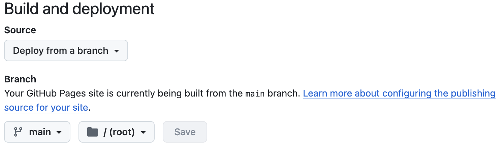

# 部署指南

本文将详细介绍如何使用 GitHub Pages 进行博客项目的部署。如果你需要在本地部署或者使用其他平台，你可能需要参考 VitePress 官方文档的部署章节。

## 使用 Github 部署

1. 在GitHub中创建两个仓库：
    - 存储此博客的仓库，名字任意。
    - 存储vitepress构建后的dist的仓库，名字为 (username).github.io。

2. 确定路径（base设置）：
    - 查看 `docs/.vitepress/config.mjs` 文件设置
    - 如何修改查看vitepress文档 https://vitepress.dev/zh/reference/site-config#base

3. 进行 `npm run docs:build`, 将打包好的文件推送到第二个仓库中.

4. 设置第二个仓库的github pages
    1. 点击setting
    2. 点击pages
    3. 按照图片设置

    

4. 部署完成后，点击右上角的 `Visit site` 按钮，你将会跳转到上传的页面。现在，你就可以通过这个地址访问你的博客网页了！

## 自定义域名

如果你想要使用自定义域名，你可以按照 GitHub Pages  的指引进行操作。

如果你还没有自己的域名，你可以在各大云服务厂商（例如腾讯云，阿里云等）购买一个。通常，他们在首年会有优惠，十几块钱一年的价格还是非常划算的。
